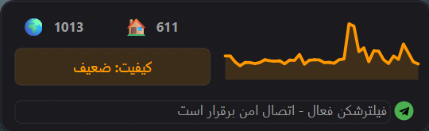

<div dir="rtl">

# پایش هوشمند اتصال اینترنت

<div align="center">


**ابزار پایش لحظه‌ای اینترنت با تشخیص هوشمند فیلترشکن — برای کاربران ایرانی**

</div>

---

<div align="center">



</div>

---

## 💡 این نرم‌افزار چیست؟

نرم افزار NetAnalyzer یک برنامه کوچک و سبک برای **Windows** است که در گوشه تسک‌بار (System Tray) اجرا می‌شود و به‌صورت لحظه‌ای وضعیت اتصال اینترنت شما را پایش می‌کند.

با یک نگاه به آیکون رنگی آن می‌فهمید که:
- اینترنت متصل است یا قطع؟
- فیلترشکن فعال است یا نه؟
- سرعت و کیفیت اتصال چقدر است؟

---

## 🎯 وضعیت‌های قابل تشخیص

| رنگ آیکون | وضعیت | توضیح |
|:---:|---|---|
| 🟢 | اتصال کامل | دسترسی آزاد به همه سرویس‌ها |
| 🟣 | فیلترشکن فعال | VPN فعال است و اتصال برقرار |
| 🟡 | فیلتر شبکه‌های اجتماعی | اینترنت داری ولی شبکه‌های اجتماعی بسته‌اند |
| 🟠 | اینترنت ملی | فقط سایت‌های داخلی باز هستند |
| ⚪ | اتصال ناپایدار | قطعی‌های موقت |
| 🔴 | بدون اینترنت | اتصال برقرار نیست |

---

## ⬇️ دانلود و نصب

### ✅ روش ۱ — Portable (ساده‌ترین روش، بدون نیاز به Python)

**مرحله ۱:** روی لینک زیر کلیک کنید تا فایل دانلود شود:

**[📥 دانلود InternetMonitor_Portable.zip](https://github.com/imsalione/NetAnalyzer-for-iran/raw/main/InternetMonitor_Portable.zip)**

**مرحله ۲:** روی فایل زیپ دانلود‌شده راست‌کلیک کنید ← **Extract All** را بزنید

**مرحله ۳:** وارد پوشه خارج‌شده شوید و روی **`InternetMonitor.exe`** دوبار کلیک کنید

**مرحله ۴:** ✅ تمام! آیکون برنامه در کنار ساعت ویندوز ظاهر می‌شود

> ⚠️ **اگر ویندوز هشدار «Windows protected your PC» داد:**
> روی **More info** کلیک کنید ← سپس **Run anyway** را بزنید.
> این هشدار به خاطر نبود امضای دیجیتال است و برنامه کاملاً ایمن است.

---

### 🐍 روش ۲ — نصب از سورس کد

<details>
<summary>📂 کلیک کنید برای نمایش مراحل</summary>

#### پیش‌نیاز: نصب Python

۱. به [python.org](https://www.python.org/downloads/) بروید و Python 3.10 یا بالاتر را دانلود کنید

۲. نصب را اجرا کنید — ⚠️ **حتماً تیک «Add Python to PATH» را بزنید**

#### دانلود و اجرا

```bash
git clone https://github.com/imsalione/NetAnalyzer-for-iran.git
cd NetAnalyzer-for-iran

# نصب وابستگی‌ها (یک بار)
install.bat

# اجرا
python main.py
```

یا روی فایل **`run.bat`** دوبار کلیک کنید.

#### ساخت فایل EXE (اختیاری)

```bash
build_exe.bat
```

فایل نهایی در `dist\InternetMonitor.exe` قرار می‌گیرد.

</details>

---

## 📖 نحوه استفاده

### پیدا کردن برنامه

بعد از اجرا، آیکون رنگی برنامه در **System Tray** ظاهر می‌شود — گوشه پایین‌راست ویندوز، کنار ساعت.

> اگر نمی‌بینید: روی فلش **`^`** کنار ساعت کلیک کنید.

### عملکردهای اصلی

| کار | چطور |
|---|---|
| دیدن جزئیات اتصال | **کلیک چپ** روی آیکون |
| باز/بستن پنجره | دوباره کلیک کنید |
| بررسی فوری | **کلیک راست** ← بررسی اکنون |
| تغییر زمان بررسی | کلیک راست ← بازه بررسی |
| پایش فیلترشکن | کلیک راست ← پایش VPN |
| خروج | کلیک راست ← خروج |

### پنجره وضعیت

- **🌍** — تأخیر به سرورهای خارجی
- **🏠** — تأخیر به سرورهای داخلی ایران
- **نمودار** — تاریخچه ۴۰ چرخه آخر (راست‌کلیک برای تغییر حالت نمایش)
- **دکمه گرد** — وضعیت فیلترشکن: 🟢 متصل / 🔴 قطع

### تنظیم پایش فیلترشکن

۱. روی آیکون **کلیک راست** کنید
۲. **پایش VPN** را انتخاب کنید
۳. یکی را انتخاب کنید: **اینستاگرام / تلگرام / توییتر**

### فیلترشکن‌های پشتیبانی‌شده

| فیلترشکن | نحوه تشخیص |
|---|---|
| **NetMod** و فیلترشکن‌های TUN | خودکار، بدون تنظیم |
| **v2rayN** | پروکسی HTTP پورت 10809 |
| **Clash / ClashX** | پروکسی HTTP پورت 7890 |
| **Shadowsocks** | پروکسی HTTP پورت 1087 |
| سایر VPN‌ها | از طریق متغیر `HTTPS_PROXY` |

---

### توضیحات فنی

نرم افزار **NetAnalyzer** یک ابزار پایش شبکه مبتنی بر معماری ناهمزمان (Asynchronous) است که با استفاده از کتابخانه‌های `asyncio` و `aiohttp` در Python، بررسی هم‌زمان چندین پلتفرم را در یک چرخه واحد انجام می‌دهد. این نرم‌افزار از یک الگوریتم سه‌لایه‌ی DNS/TCP/HTTP برای تشخیص دقیق نوع انسداد بهره می‌گیرد و با پیاده‌سازی مکانیزم Circuit Breaker، از اتلاف منابع در بررسی پلتفرم‌های مکرراً ناموفق جلوگیری می‌کند. موتور تشخیص پروکسی نرم‌افزار، پورت‌های رایج فیلترشکن‌های متداول نظیر v2rayN، Clash و Shadowsocks را اسکن کرده و صحت عملکرد آن‌ها را پیش از اعمال روی ترافیک، از طریق یک درخواست HTTP آزمایشی تأیید می‌کند.

موتور طبقه‌بندی وضعیت (Connection Classifier) از رویکرد گروه‌بندی حالت‌ها (State Grouping) استفاده می‌کند که در آن تغییرات میان‌گروهی — مانند انتقال از حالت «محدودیت» به «اتصال کامل» — به‌صورت فوری و بدون انتظار برای رأی‌گیری اکثریت اعمال می‌شوند، در حالی که تغییرات درون‌گروهی از یک پنجره هموارسازی (Smoothing Window) برای جلوگیری از نوسان‌های کاذب بهره می‌برند. رابط کاربری گرافیکی نرم‌افزار با استفاده از چارچوب PyQt6 پیاده‌سازی شده و از طریق یکپارچه‌سازی حلقه رویداد Qt با `qasync`، اجرای موازی وظایف ناهمزمان و به‌روزرسانی بلادرنگ رابط کاربری را بدون مسدودسازی thread اصلی تضمین می‌کند.

---

## ❓ سؤالات رایج

<details>
<summary><b>برنامه باز نمی‌شود یا خطای Windows SmartScreen می‌دهد</b></summary>

روی **More info** کلیک کنید، سپس **Run anyway** را بزنید. این هشدار به خاطر نبود امضای دیجیتال است و برنامه ایمن است.

</details>

<details>
<summary><b>آیکون در System Tray نیست</b></summary>

روی فلش `^` کنار ساعت ویندوز کلیک کنید. آیکون را می‌توانید با drag به قسمت اصلی بکشید تا همیشه نمایش داشته باشد.

</details>

<details>
<summary><b>فیلترشکن فعال است ولی نرم‌افزار تشخیص نمی‌دهد</b></summary>

چند ثانیه صبر کنید — بررسی هر ۵ ثانیه انجام می‌شود. اگر مشکل ادامه داشت، کلیک راست ← **بررسی اکنون** را بزنید.

</details>

<details>
<summary><b>آیا این نرم‌افزار اطلاعات جمع‌آوری می‌کند؟</b></summary>

خیر. فقط درخواست‌های کوچک HTTP برای بررسی دسترسی به سایت‌ها ارسال می‌شود. هیچ اطلاعات شخصی جمع‌آوری یا ارسال نمی‌شود.

</details>

---

## 📡 پلتفرم‌های پایش‌شده

| دسته | پلتفرم‌ها | هدف |
|---|---|---|
| 📱 شبکه اجتماعی | Instagram، Telegram، Twitter/X | تشخیص فیلترینگ |
| 🌍 بین‌المللی | Google، Cloudflare، Microsoft | تشخیص دسترسی خارجی |
| 🏠 داخلی | IRNA، ISNA، Digikala | تشخیص اینترنت ملی |

---

## 🤝 مشارکت و گزارش مشکل

- 🐛 **باگ پیدا کردید؟** [گزارش دهید](https://github.com/imsalione/NetAnalyzer-for-iran/issues/new)
- 💡 **پیشنهاد دارید؟** [مطرح کنید](https://github.com/imsalione/NetAnalyzer-for-iran/issues/new)
- 🔧 **می‌خواهید کمک کنید؟** Pull Request بفرستید

---

## 📄 مجوز

این پروژه تحت [مجوز MIT](LICENSE) منتشر شده — استفاده، تغییر و توزیع آن آزاد است.

---

<div align="center">

ساخته شده با ❤️ برای کاربران ایرانی

</div>

</div>
